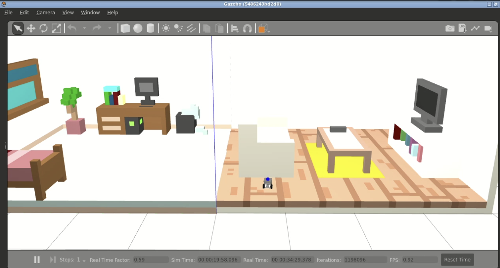

# The Fastbot ROS2 Dockers

This repository contains docker ROS 2 images necessary to operate and extend the Fastbot robot. Running containerized ROS 2 environment enables testing the robot in Gazebo simulation environment as well as seamless deployment of SLAM and navigation capabilities on the real robot, making it easier to manage dependencies and run advanced robotics software reliably on the Raspberry Pi 4.

<p align="center">
 
</p>

## Prerequisites

- Docker Engine and Compose

## Getting Started

1. Install docker:

    ```bash
    sudo apt-get update
    sudo apt-get install -y docker.io docker-compose
    sudo service docker start
    ```

    Optionally, enable docker commands without root:
    ```bash
    sudo usermod -aG docker $USER
    newgrp docker
    sudo service docker restart
    ```

2. Clone this repository anywhere within your workspace:
    ```bash
    git clone <this-repo-url>
    ```

## Simulation Containers

Running compose, the required docker images will be downloaded from cloud and the ROS2 containers will be started up and ready. Navigate into the repo directory and run the compose command. This will start Gazebo container with Fastbot robot, slam nodes and webapp to interact with.

```bash
cd fastbot_ros2_docker/simulation
docker-compose up
```

After all set, check running containers in a second terminal:
```bash
sudo docker ps
```

**Expected result:**
```
CONTAINER ID   IMAGE                                      COMMAND                  CREATED          STATUS          PORTS                            NAMES
a123d0b83cf3   kuralme/kuralme-cp22:fastbot-ros2-slam     "/bin/bash -c 'sleep…"   14 minutes ago   Up 14 minutes                            fastbot-ros2-slam
397bd210f7e4   kuralme/kuralme-cp22:fastbot-ros2-webapp   "/bin/bash /entrypoi…"   14 minutes ago   Up 14 minutes   0.0.0.0:9090->9090/tcp, :::9090->9090/tcp, 0.0.0.0:7000->80/tcp, :::7000->80/tcp   fastbot-ros2-webapp
5406243bd2d0   kuralme/kuralme-cp22:fastbot-ros2-gazebo   "/bin/bash -c 'sourc…"   14 minutes ago   Up 14 minutes                            fastbot-ros2-gazebo
```

### Webapp interaction

Access the webpage using the command to get the url and rosbridge address to connect to ROS2 network through webapp.

```bash
$ webpage_address
https://i-....robotigniteacademy.com/.../webpage/
$ rosbridge_address
wss://i-....robotigniteacademy.com/.../rosbridge/
```

Enter the rosbridge address inside the *ROSBridge address* text box and click *Connect*. Robot odometry data and the simulation environment map should be visible, if connection was successful.

Use the joystick and see that robot moves in the simulation.

### Navigation

We can also navigate the robot using the nav2 slam package:
- Set an initial pose in Rviz using the 2D Pose Estimate tool to help the localization server. Once localization is active, the Nav2 path planner can be used. 
- Send navigation goals with the 2D Nav Goal tool in Rviz to move the robot around the environment.

## Real Robot Containers

Refer to the Fastbot parent [project](https://github.com/kuralme/fastbot) and Docker setup for more detailed information.